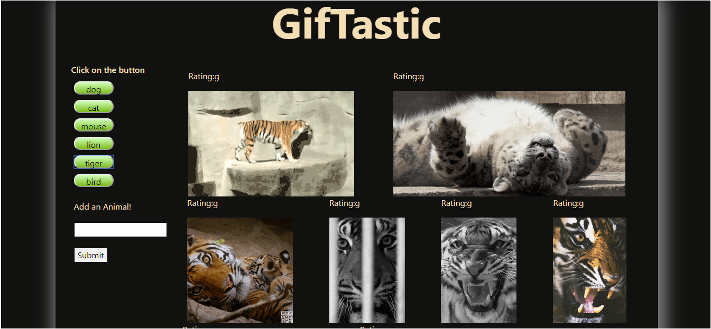

# GifTastic

## About
This application uses GIPHY API to create a dynamic web page to populate gifs of your choice.

## How it works
Click on the pre-existing buttons to populate the gifs or search and add a new button of your choice.

* [Try it out](https://nmalk.github.io/GifTastic/)

## Technologies used
HTML, CSS, JavaScript, JQuery, AJAX, Bootstrap